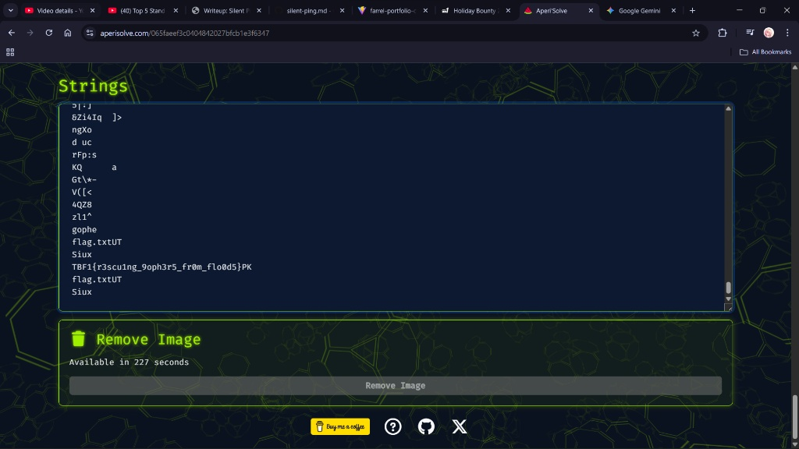

# Broken Gopher

Investigasi forensik digital terhadap file gambar yang mengalami kerusakan (corruption) untuk memulihkan data rahasia yang tersembunyi.


## The Scenario

Kami menerima sinyal darurat dari seekor Gopher yang terjebak di dalam "burrow" digitalnya. Laporan menyebutkan bahwa lingkungan tersebut membanjir dengan *corrupted data*.

Satu-satunya bukti yang berhasil dikirimkan keluar adalah sebuah foto bernama `broke.jpg`. Saat dibuka, gambar tersebut hanya menampilkan bagian kepala Gopher dengan jelas, sementara bagian bawahnya hancur menjadi *glitch* dan artefak visual yang kacau, menandakan adanya kerusakan pada struktur data file.

## Reconnaissance

Analisis visual awal mengonfirmasi bahwa header file JPEG masih utuh (karena gambar masih bisa dibuka), namun *scan data* di bagian tengah hingga akhir mengalami kerusakan parah.

Alih-alih mencoba memperbaiki *byte* gambar untuk memulihkan visual (yang mungkin sudah hilang permanen), saya mencurigai bahwa "banjir data" tersebut sebenarnya menyembunyikan informasi tekstual atau *file signature* lain di dalam *binary blob* gambar tersebut.

Saya menggunakan platform analisis steganografi **Aperi'Solve** untuk membedah struktur file tanpa harus melakukan ekstraksi manual yang rumit.

## Extraction Strategy

Pada tahap ini, fokus utama adalah mencari *printable strings* (karakter yang bisa dibaca manusia) di antara data biner yang acak.

Di Aperi'Solve, saya menavigasi ke fitur **Strings**. Fitur ini bekerja mirip dengan command CLI `strings` di Linux, yang menyaring dan menampilkan urutan karakter ASCII yang terbaca.



Dari ribuan baris output yang dihasilkan, saya melakukan filter manual untuk mencari format flag yang dikenal.

**Output yang ditemukan:**

```text
...
4QZ8
zl1^
gophe
flag.txtUT
Siux
TBF1{r3scu1ng_9oph3r5_fr0m_flo0d5}PK
flag.txtUT
Siux
...

```

Terlihat bahwa flag tersebut berada di bagian akhir file, tepat sebelum header `PK` (yang mengindikasikan adanya struktur file ZIP atau arsip yang di-*append* ke gambar).

## The Verdict

Masalah ini bukan sekadar kerusakan file biasa, melainkan teknik steganografi di mana data teks (atau file lain) disisipkan atau ditempelkan (appended) ke akhir file gambar asli. Hal ini sering kali merusak *footer* gambar atau menyebabkan *renderer* gambar menjadi bingung, menghasilkan visual *glitch* seperti yang terlihat.

Data rahasia berhasil diselamatkan dari banjir data tersebut:

> TBF1{r3scu1ng_9oph3r5_fr0m_flo0d5}
